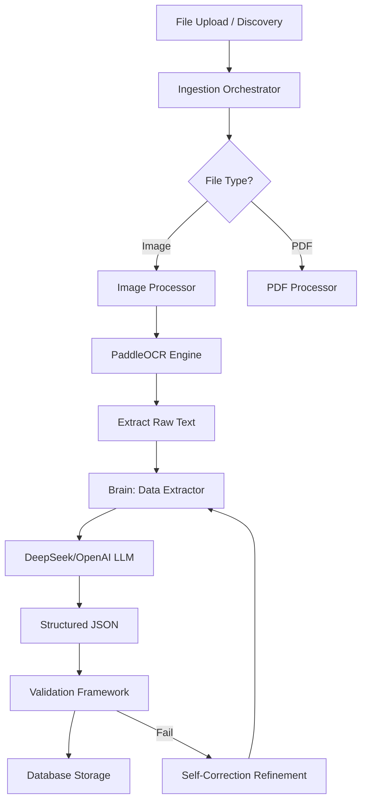

# OCR Implementation Documentation

This document describes the workflow, tech stack, and internal mechanics of the OCR (Optical Character Recognition) implementation within the AI-eInvoicing application.

## Overview

The OCR system is designed to handle various image formats (JPG, PNG, WebP, Avif) and extract structured invoice data using a combination of local OCR engines and Large Language Models (LLMs).

---

## Technical Stack

### Core Components
- **OCR Engine**: [PaddleOCR](https://github.com/PaddlePaddle/PaddleOCR) (CPU-optimized mode).
- **Extraction**: [DeepSeek-Chat](https://api-docs.deepseek.com/) (primary) or OpenAI GPT-4.
- **Framework**: FastAPI (Interface), SQLAlchemy (Core), LlamaIndex/Direct OpenAI (Brain).
- **Storage**: PostgreSQL with JSONB for flexible schema storage.

---

## Folder Structure & Responsibility

### 1. Ingestion Layer (`ingestion/`)
- **[image_processor.py](file:///Users/william.jiang/my-apps/ai-einvoicing/ingestion/image_processor.py)**:
    - Lazy initialization of `PaddleOCR` to save memory.
    - Resource monitoring: Checks available RAM before processing.
    - Image Pre-processing: Resizes large images (max 1500px) to prevent OOM (Out Of Memory) errors.
    - Thread-pool execution: OCR runs in a background thread to prevent blocking the async event loop.
- **[orchestrator.py](file:///Users/william.jiang/my-apps/ai-einvoicing/ingestion/orchestrator.py)**:
    - Coordinates the flow from file hashing to database commits.
    - Implements retry logic for OCR timeouts.

### 2. Brain Layer (`brain/`)
- **[extractor.py](file:///Users/william.jiang/my-apps/ai-einvoicing/brain/extractor.py)**:
    - Uses LLMs (DeepSeek/OpenAI) to map raw OCR text to a structured Pydantic schema (`ExtractedDataSchema`).
    - Implements "Self-Correction": If validation fails, it re-prompts the LLM with error feedback to refine the results.
- **[validator.py](file:///Users/william.jiang/my-apps/ai-einvoicing/brain/validator.py)**:
    - Mathematical consistency checks (Subtotal + Tax = Total).
    - Line item sum verification.
    - Vendor sanity checks (especially for Chinese '增值税' invoices).

### 3. Core Layer (`core/`)
- **[models.py](file:///Users/william.jiang/my-apps/ai-einvoicing/core/models.py)**: Defines the `Invoice`, `ExtractedData`, and `ValidationResult` tables.
- **[config.py](file:///Users/william.jiang/my-apps/ai-einvoicing/core/config.py)**: Manages API keys and model settings (DeepSeek vs OpenAI).

### 4. Interface Layer (`interface/`)
- **[api/routes/uploads.py](file:///Users/william.jiang/my-apps/ai-einvoicing/interface/api/routes/uploads.py)**: Handles multipart file uploads and triggers background processing tasks.
- **[dashboard/](file:///Users/william.jiang/my-apps/ai-einvoicing/interface/dashboard/)**: Streamlit-based UI for visualizing extraction quality and confidence scores.

---

## Performance & Reliability Features

### Resource Management
To ensure stability on resource-constrained environments:
- **Memory Guards**: The system aborts OCR if free memory is below 300MB.
- **Downscaling**: Images larger than 2MB or 1500px are automatically resized before being fed to PaddleOCR.
- **Async Isolation**: Blocking CPU-bound OCR work is offloaded to `ThreadPoolExecutor`.

### Quality Assurance
- **Confidence Scoring**: Each extraction returns a confidence level (calculated by LLM and PaddleOCR).
- **Validation Rules**: Automated checks catch mathematical errors common in OCR "hallucinations".
- **Refinement Loop**: Failed validations trigger a secondary "Refine" stage where the LLM is given the error trace to fix specific fields.

---

## Workflow Example: Processing a Chinese Invoice

1. **Upload**: User sends `9.png` via API.
2. **Discovery**: `orchestrator` detects image type and calculates SHA-256.
3. **OCR**: `image_processor` calls PaddleOCR (with `lang="ch"`).
4. **Extraction**: `extractor` sends raw text + filename hints to DeepSeek.
5. **Validation**: `validator` checks if the 销售方 (Vendor) name exists and if math adds up.
6. **Persistence**: Results stored in `extracted_data` table; status set to `COMPLETED`.
