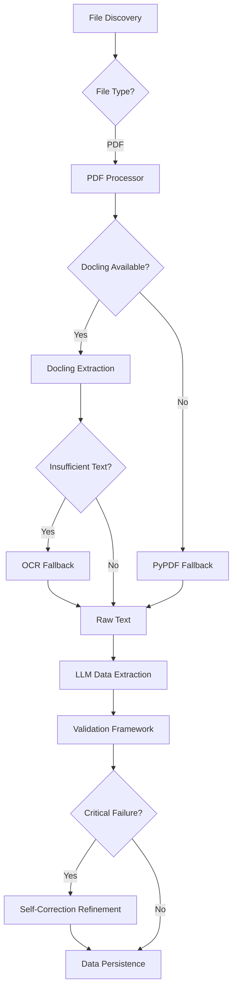

# PDF Processing Implementation

This document details the workflow and technology stack for processing PDF invoices within the application.

## 1. Overview Workflow

The PDF processing pipeline follows a multi-stage approach to ensure high-quality data extraction even from complex or image-based PDFs.

## 2. Component Breakdown

### 📂 Ingestion Layer (`ingestion/`)

Responsible for handling file types and raw text extraction.

*   **[pdf_processor.py](file:///Users/william.jiang/my-apps/ai-einvoicing/ingestion/pdf_processor.py)**: 
    *   **Primary (Docling)**: Uses IBM's `docling` to convert PDFs to Markdown, preserving layout and tables.
    *   **Fallback (PyPDF)**: Slower/simpler extraction if Docling is unavailable.
    *   **OCR Support**: If text extraction yields < 100 characters (indicating a scanned image), it triggers an OCR fallback.
*   **[orchestrator.py](file:///Users/william.jiang/my-apps/ai-einvoicing/ingestion/orchestrator.py)**: Coordinates the sequential flow from file hashing to database storage.

### 🧠 Brain Layer (`brain/`)

Handles intelligence, extraction, and validation.

*   **[extractor.py](file:///Users/william.jiang/my-apps/ai-einvoicing/brain/extractor.py)**: 
    *   Uses **OpenAI/DeepSeek** LLMs to map raw text to structured JSON.
    *   Implements `refine_extraction` for self-correction when validation fails.
*   **[schemas.py](file:///Users/william.jiang/my-apps/ai-einvoicing/brain/schemas.py)**: Defines `ExtractedDataSchema` using Pydantic, including per-field confidence scores.
*   **[validator.py](file:///Users/william.jiang/my-apps/ai-einvoicing/brain/validator.py)**: Runs math checks (Subtotal + Tax = Total), date consistency, and vendor sanity rules.

### ⚙️ Core & Data Layers (`core/`, `data/`)

Manage state, models, and storage.

*   **[models.py](file:///Users/william.jiang/my-apps/ai-einvoicing/core/models.py)**: SQLAlchemy models for `Invoice`, `ExtractedData`, and `ValidationResult`.
*   **Storage**: 
    *   Original files stored in `data/pdf/` or `data/uploads/`.
    *   Encrypted copies (if enabled) in `data/encrypted/`.

## 3. Technology Stack

| Component | Technology | Description |
| :--- | :--- | :--- |
| **PDF Conversion** | [Docling](https://github.com/DS4SD/docling) | Advanced document layout analysis and markdown export. |
| **OCR Fallback** | [PaddleOCR](https://github.com/PaddlePaddle/PaddleOCR) | High-accuracy OCR for scanned documents. |
| **Extraction** | [LlamaIndex](https://www.llamaindex.ai/) / OpenAI | Agentic RAG and structured data extraction. |
| **LLM** | DeepSeek-V3 / GPT-4o | Specialized models for high-accuracy extraction. |
| **Validation** | [Pydantic v2](https://docs.pydantic.dev/) | Strict schema validation and data normalization. |
| **Database** | [SQLAlchemy 2.0](https://www.sqlalchemy.org/) | Modern ORM with PostgreSQL backend. |

## 4. Key Features

> [!IMPORTANT]
> **Layout Preservation**: Docling ensures that tables and headers are represented as Markdown, which significantly improves LLM extraction accuracy compared to raw text.

> [!TIP]
> **Self-Correction**: If mathematical validations fail (e.g., tax doesn't add up), the system automatically performs a "Refinement" pass with the LLM, feeding the error message back as a prompt hint.
